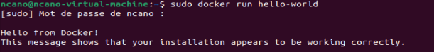
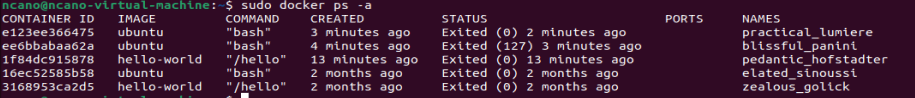
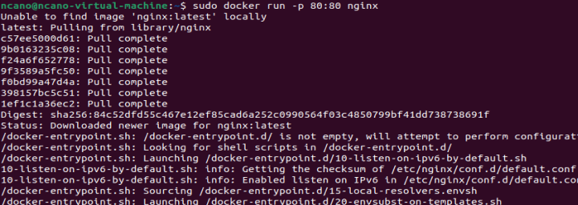
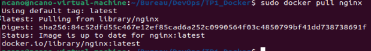
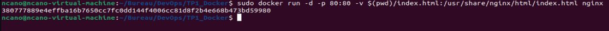
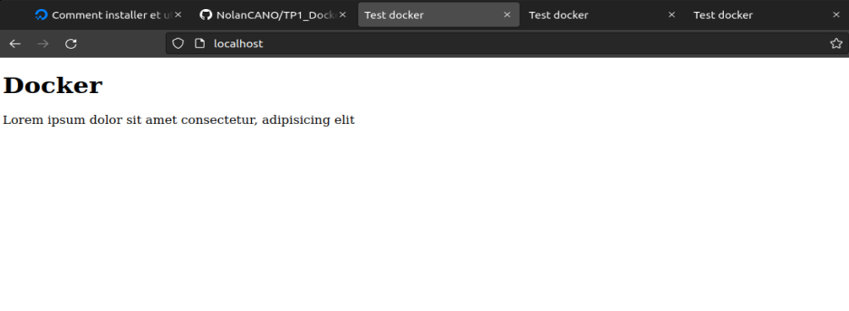
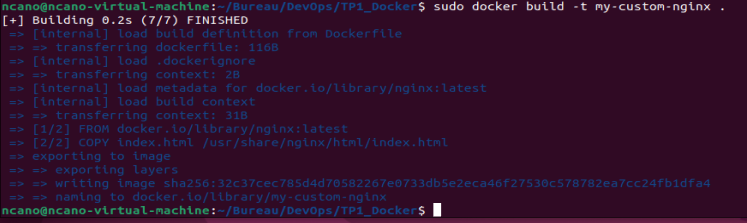
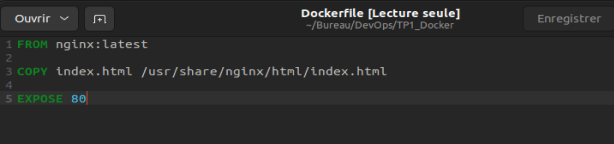
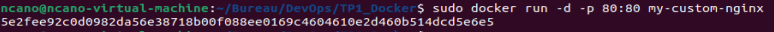

# 2. Quelques commandes à tester

### Après avoir installé Docker, j’ai tester les commandes suivantes :
	
## Hello World avec Docker:

## Créer un conteneur Ubuntu et utiliser Bash:

## Afficher les images Docker locales :

## Afficher tous les conteneurs (actifs ou non) :

## Démarrer un serveur web Nginx :

## Pour l'exécuter en arrière-plan, ajoutez -d :

# 4. Début du TP

### J’ai initialiser un nouveau repository Git appeler TP1_Docker

# 5. Exécuter un serveur web dans un conteneur Docker

## a. Récupérer l’image sur le Docker Hub :

## b. Vérifier que cette image est présente en local :

## c. Créer un fichier index.html simple :

## d. Démarrer un conteneur et servir la page html créée précédemment à l’aide d’un volume (option -v de docker run) :

## e. Supprimer le conteneur précédent et arriver au même résultat que précédemment à l’aide de la commande docker cp 

# 6. Builder une image 

## a. A l’aide d’un Dockerfile, créer une image (commande docker build) 

### Dockerfile :

## b. Exécuter cette nouvelle image de manière à servir la page html (commande docker run)

## c. Quelles différences observez-vous entre les procédures 5. et 6. ? Avantages et inconvénients de l’une et de l’autre méthode ?

### Procédures 5 :

### Avantages:

- Les modifications apportées au fichier index.html sur l'hôte sont immédiatement visibles dans le conteneur sans nécessiter de reconstruire l'image.
- Le fichier index.html n'est pas inclus dans l'image elle-même, ce qui signifie que vous pouvez utiliser la même image Docker pour différents contenus en montant différents volumes.

### Inconvénients:

- Pour exécuter le conteneur ailleurs, vous avez besoin de configurer le volume et vous assurer que le fichier index.html est présent sur l'hôte.
- Le conteneur dépend des fichiers de l'hôte, ce qui peut poser des problèmes de compatibilité ou de permissions entre différents environnements d'hébergement.

### Procédures 6:

### Avantages:

- L'image contient déjà index.html, ce qui rend le déploiement plus simple et plus cohérent sur différents hôtes ou environnements.
- L'image fonctionne de manière autonome sans dépendre des fichiers de l'hôte.

### Inconvénients:

- Si vous devez modifier index.html, vous devez reconstruire et redéployer l'image Docker.
- Si vous avez plusieurs images avec différents index.html, chacune utilise de l'espace disque supplémentaire pour stocker essentiellement le même contenu de base de l'image Nginx avec seulement de petites variations.