# 2. Quelques commandes à tester

### Après avoir installé Docker, j’ai tester les commandes suivantes :
	
## Hello World avec Docker:

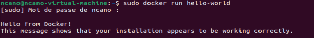

## Créer un conteneur Ubuntu et utiliser Bash:

## Afficher les images Docker locales :

## Afficher tous les conteneurs (actifs ou non) :

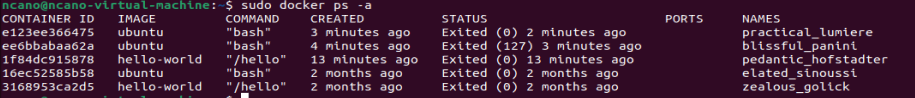

## Démarrer un serveur web Nginx :

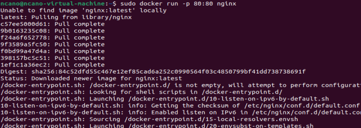

## Pour l'exécuter en arrière-plan, ajoutez -d :

# 4. Début du TP

### J’ai initialiser un nouveau repository Git appeler TP1_Docker

# 5. Exécuter un serveur web dans un conteneur Docker

## a. Récupérer l’image sur le Docker Hub :

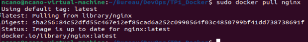

## b. Vérifier que cette image est présente en local :

## c. Créer un fichier index.html simple :

## d. Démarrer un conteneur et servir la page html créée précédemment à l’aide d’un volume (option -v de docker run) :

## e. Supprimer le conteneur précédent et arriver au même résultat que précédemment à l’aide de la commande docker cp 

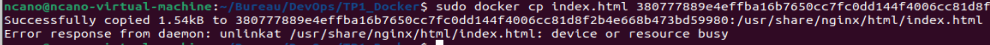

# 6. Builder une image 

## a. A l’aide d’un Dockerfile, créer une image (commande docker build) 

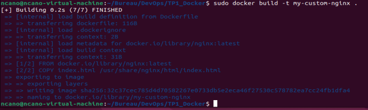

### Dockerfile :

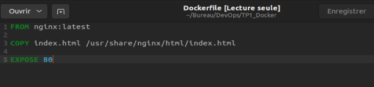

## b. Exécuter cette nouvelle image de manière à servir la page html (commande docker run)

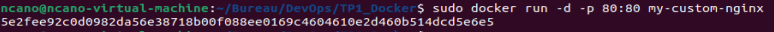

## c. Quelles différences observez-vous entre les procédures 5. et 6. ? Avantages et inconvénients de l’une et de l’autre méthode ?

### Procédures 5 :

### Avantages:

- Les modifications apportées au fichier index.html sur l'hôte sont immédiatement visibles dans le conteneur sans nécessiter de reconstruire l'image.
- Le fichier index.html n'est pas inclus dans l'image elle-même, ce qui signifie que vous pouvez utiliser la même image Docker pour différents contenus en montant différents volumes.

### Inconvénients:

- Pour exécuter le conteneur ailleurs, vous avez besoin de configurer le volume et vous assurer que le fichier index.html est présent sur l'hôte.
- Le conteneur dépend des fichiers de l'hôte, ce qui peut poser des problèmes de compatibilité ou de permissions entre différents environnements d'hébergement.

### Procédures 6:

### Avantages:

- L'image contient déjà index.html, ce qui rend le déploiement plus simple et plus cohérent sur différents hôtes ou environnements.
- L'image fonctionne de manière autonome sans dépendre des fichiers de l'hôte.

### Inconvénients:

- Si vous devez modifier index.html, vous devez reconstruire et redéployer l'image Docker.
- Si vous avez plusieurs images avec différents index.html, chacune utilise de l'espace disque supplémentaire pour stocker essentiellement le même contenu de base de l'image Nginx avec seulement de petites variations.

# 7. Utiliser une base de données dans un conteneur docker

## a. Récupérer les images mysql:5.7 et phpmyadmin depuis le Docker Hub

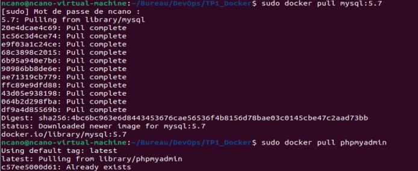

## b. Exécuter deux conteneurs à partir des images et ajouter une table ainsi que quelques enregistrements dans la base de données à l’aide de phpmyadmin

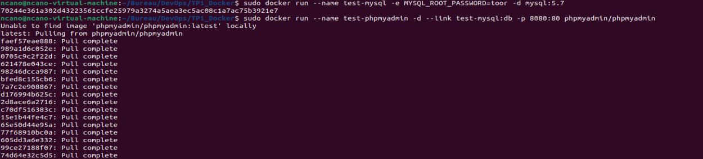

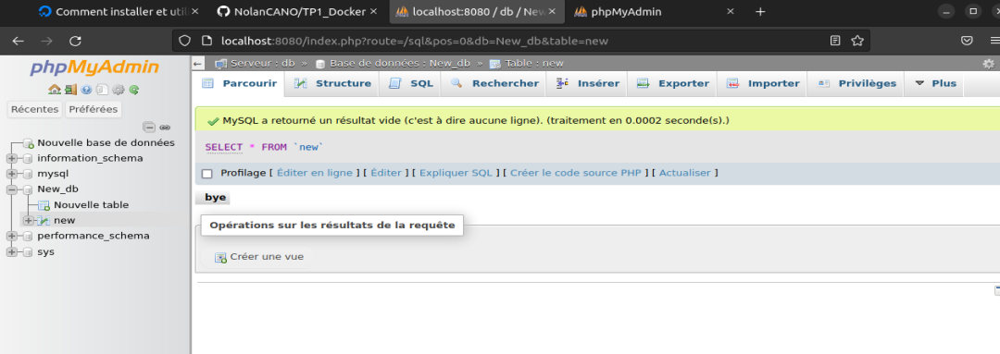

# 8. Faire la même chose que précédemment en utilisant un fichier

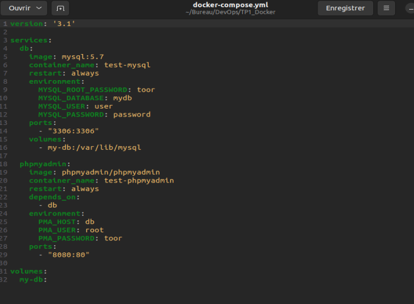

## a. Qu’apporte le fichier docker-compose par rapport aux commandes docker run ? Pourquoi est-il intéressant ?

- Le fichier docker-compose.yml permet de configurer votre application en une seule fois plutôt que de lancer chaque conteneur séparément avec des commandes docker run.
- Tous les paramètres de configuration sont stockés dans un fichier, ce qui rend la gestion des paramètres plus organisée et lisible.
- Docker Compose permet de démarrer, d'arrêter et de reconstruire les services avec une seule commande.

## b. Configuration du conteneur MySQL au lancement :

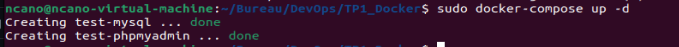

Le fichier docker-compose.yml permet de définir facilement des variables d'environnement pour la configuration initiale du conteneur MySQL, telles que le mot de passe root, un premier utilisateur, un mot de passe pour cet utilisateur et une base de données initiale (MYSQL_DATABASE).

# 9. Observation de l’isolation réseau entre 3 conteneurs

## a. A l’aide de docker-compose et de l’image praqma/network-multitool disponible sur le Docker Hub créer 3 services (web, app et db) et 2 réseaux (frontend et backend).

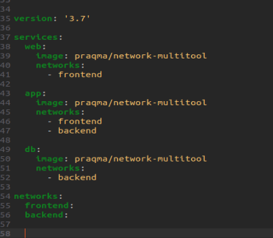

Le service web est seulement sur le réseau frontend, tandis que le service db est seulement sur le réseau backend. Le service app sert de pont car il est sur les deux réseaux. Cela signifie que web et db ne peuvent pas communiquer directement entre eux car ils n'ont aucun réseau en commun.

## b. Quelles lignes du résultat de la commande docker inspect justifient ce comportement ?

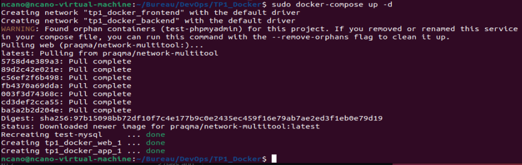

On va maintenant utiliser la commande "sudo docker inspect <name_container>" pour voir la configuration Network des 3 conteneurs:

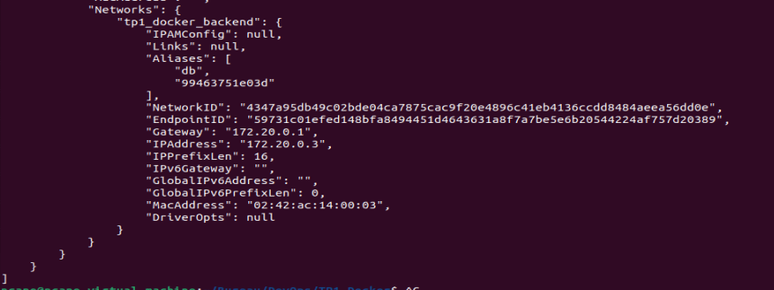

- La sortie montre que le conteneur est connecté au réseau tp1_docker_backend.
- L'alias dans ce réseau est db.
- Cela correspond au conteneur de base de données (db).

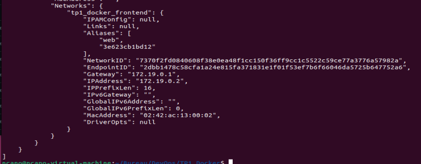

- Ce conteneur est connecté au réseau tp1_docker_frontend.
- L'alias dans ce réseau est web.
- Cela correspond au conteneur de service web (web).

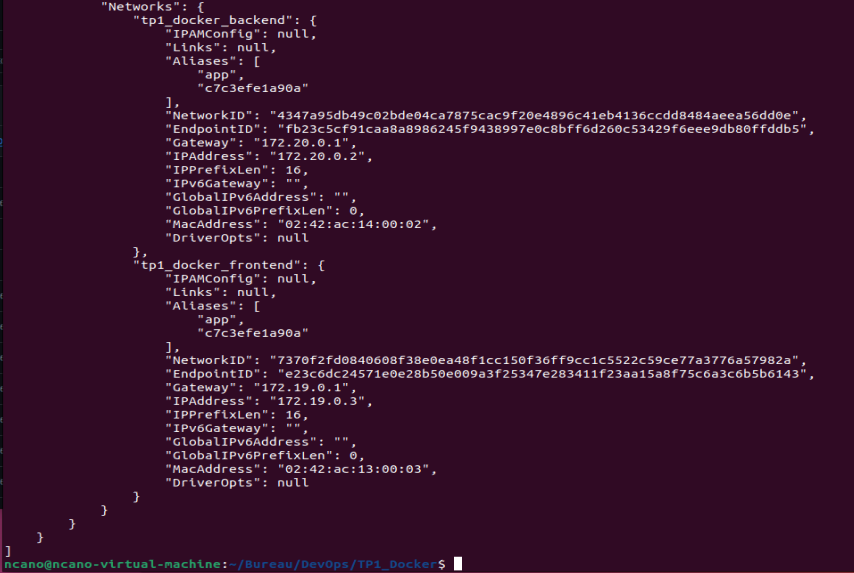

- Ce conteneur est connecté à deux réseaux : tp1_docker_backend et tp1_docker_frontend.
- L'alias dans ces réseaux est app.
- Cela correspond au conteneur d'application intermédiaire (app) qui est capable de communiquer avec les deux services web et db.

## c. Dans quelle situation réelles (avec quelles images) pourrait-on avoir cette configuration réseau ? Dans quel but ?

L'objectif principal de cette configuration est de renforcer la sécurité en limitant l'exposition des services sensibles (comme la base de données) uniquement aux services internes (comme l'application) et en évitant leur exposition directe au monde extérieur. Cela crée une couche supplémentaire de sécurité.

---

*by Nolan*