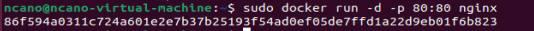

# 2. Quelques commandes à tester

### Après avoir installé Docker, j’ai tester les commandes suivantes :
	
## Hello World avec Docker:

## Créer un conteneur Ubuntu et utiliser Bash:

## Afficher les images Docker locales :

## Afficher tous les conteneurs (actifs ou non) :

## Démarrer un serveur web Nginx :

## Pour l'exécuter en arrière-plan, ajoutez -d :

# 4. Début du TP

### J’ai initialiser un nouveau repository Git appeler TP1_Docker

# 5. Exécuter un serveur web dans un conteneur Docker

## a. Récupérer l’image sur le Docker Hub :

## b. Vérifier que cette image est présente en local :

## c. Créer un fichier index.html simple :

## d. Démarrer un conteneur et servir la page html créée précédemment à l’aide d’un volume (option -v de docker run) :

## e. Supprimer le conteneur précédent et arriver au même résultat que précédemment à l’aide de la commande docker cp 

