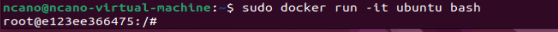

# 2. Quelques commandes à tester

### Après avoir installé Docker, j’ai tester les commandes suivantes :
	
## Hello World avec Docker:

## Créer un conteneur Ubuntu et utiliser Bash:

## Afficher les images Docker locales :

## Afficher tous les conteneurs (actifs ou non) :

## Démarrer un serveur web Nginx :

## Pour l'exécuter en arrière-plan, ajoutez -d :

